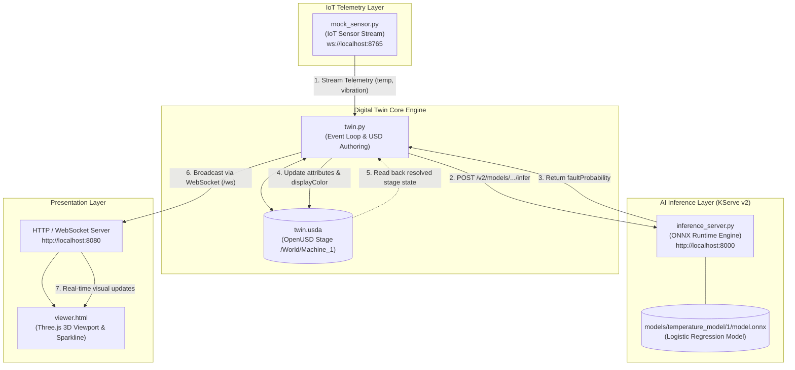

# Machine Digital Twin

A real-time **IoT Machine Digital Twin** powered by **Pixar OpenUSD**, **AI Fault Prediction** via **ONNX Runtime** (KServe v2 / NVIDIA Triton-compatible protocol), and an interactive **WebGL / Three.js 3D Viewer**.


---

## Overview

This project implements a complete, live digital twin loop for an industrial machine (`Machine_1`):

1. **IoT Sensor Emulation**: Simulates streaming physical telemetry (temperature, vibration) with periodic thermal runaway episodes over WebSocket.
2. **AI Fault Prediction**: An ONNX machine learning model evaluates live telemetry against a learned risk surface to predict failure probability.
3. **KServe v2 / Triton Protocol**: The local inference engine exposes Triton's HTTP API (`v2`), allowing zero-code migration between local ONNX Runtime and enterprise NVIDIA Triton Inference Servers.
4. **OpenUSD as the Source of Truth**: Telemetry and AI state are authored directly into an OpenUSD stage (`twin.usda`). State is read back from USD prim attributes—mirroring how NVIDIA Omniverse and 3D simulation runtimes function.
5. **Interactive 3D Web Dashboard**: A browser-based Three.js viewport renders the machine geometry, dynamically updates its shader material based on USD display colors, and plots live metrics alongside a 60-second rolling sparkline.

---

## Flow Diagram

### System Architecture & Data Flow



### Real-Time Execution Loop

```mermaid
sequenceDiagram
    autonumber
    participant Sensor as mock_sensor.py
    participant Twin as twin.py
    participant Inference as inference_server.py
    participant USD as twin.usda (OpenUSD)
    participant UI as viewer.html (Browser)

    Sensor->>Twin: WebSocket event: {temperature, vibration, timestamp}
    Twin->>Inference: POST /v2/models/temperature_model/infer
    Inference-->>Twin: 200 OK: {outputs: [faultProbability]}
    
    rect rgb(30, 35, 45)
        Note over Twin,USD: OpenUSD Source of Truth Update
        Twin->>USD: Set prim attributes (twin:temperature, twin:vibration, twin:faultProbability, twin:status)
        Twin->>USD: Set primvars:displayColor (Green=HEALTHY / Red=FAULT)
        Twin->>USD: stage.Save()
        Twin->>USD: Read back prim attributes & displayColor
    end

    Twin->>UI: Broadcast state via WebSocket (/ws)
    UI->>UI: Update Three.js mesh color from USD displayColor
    UI->>UI: Update telemetry cards & 60s sparkline history
```



---

## Key Concepts & Design Decisions

- **USD as Single Source of Truth**: Rather than sending sensor readings directly to the user interface, `twin.py` writes the state to `/World/Machine_1` on the OpenUSD stage, saves it to disk, and reads back the stage properties to forward to clients. This ensures the digital twin state is always identical to what a USD renderer (like NVIDIA Omniverse Create or View) displays.
- **KServe v2 Protocol Compatibility**: `inference_server.py` implements the standardized KServe v2 data plane (`/v2/health/ready`, `/v2/models/{model}/ready`, `/v2/models/{model}/infer`). You can swap `inference_server.py` with an actual NVIDIA Triton container running on GPU with zero code modifications to `twin.py`.
- **Fault Detection Model**: `train_model.py` generates synthetic sensor training distributions and fits a logistic regression classifier:
  $$\text{risk} = 0.25 \times (\text{temp} - 82) + 18 \times (\text{vib} - 0.42)$$
  The model folds normalization parameters into weights and exports a standalone ONNX computation graph: $\hat{y} = \sigma(XW + b)$.

---

## Repository Structure

```
.
├── models/
│   └── temperature_model/
│       └── 1/
│           └── model.onnx       # Exported ONNX model (Triton directory structure)
├── inference_server.py          # Local KServe v2 / Triton HTTP server (port 8000)
├── mock_sensor.py               # Simulated IoT sensor WebSocket server (port 8765)
├── requirements.txt             # Python dependencies
├── run.sh                       # One-command runner script (launches all services)
├── test_inference.py            # Quick smoke test for the inference server
├── train_model.py               # Generates data & trains the ONNX model
├── twin.py                      # Core digital twin runtime & web server (port 8080)
├── twin.usda                    # OpenUSD ASCII stage (updated dynamically)
└── viewer.html                  # Three.js 3D dashboard & telemetry sparkline
```

---

## Telemetry & USD Attributes

### Sensor Payload (`ws://localhost:8765`)
```json
{
  "machine_id": "Machine_1",
  "timestamp": 1790503293.16,
  "temperature": 74.25,
  "vibration": 0.215
}
```

### OpenUSD Prim Definition (`twin.usda` at `/World/Machine_1`)
| Attribute | Type | Description |
| :--- | :--- | :--- |
| `primvars:displayColor` | `color3f[]` | Mesh color: Healthy `(0.1, 0.75, 0.3)` or Fault `(0.9, 0.1, 0.05)` |
| `twin:temperature` | `float` | Latest sensor temperature reading in °C |
| `twin:vibration` | `float` | Latest sensor vibration reading in g |
| `twin:faultProbability` | `float` | AI model failure probability score $[0.0, 1.0]$ |
| `twin:status` | `string` | Machine state (`"HEALTHY"` or `"FAULT"`) |
| `twin:lastUpdate` | `double` | Epoch timestamp of last stage sync |

---

## Installation & Setup

### 1. Prerequisites

- Python 3.10 or higher
- `pip` package manager

### 2. Setup Virtual Environment

```bash
# Clone repository and navigate inside
cd machine-digital-twin

# Create virtual environment
python3 -m venv .venv

# Activate virtual environment
# macOS / Linux:
source .venv/bin/activate
# Windows:
# .venv\Scripts\activate

# Install dependencies
pip install -r requirements.txt
```

### 3. Verify or Re-train the Model (Optional)

The pre-trained model is already located at `models/temperature_model/1/model.onnx`. If you want to retrain the logistic regression model and re-export the ONNX graph:

```bash
python train_model.py
```

Expected output:
```text
training accuracy: 0.985
saved models/temperature_model/1/model.onnx
temp=65 vib=0.15 -> fault probability 0.00
temp=80 vib=0.35 -> fault probability 0.23
temp=90 vib=0.5 -> fault probability 0.97
```

---

## How to Run

You can run the digital twin stack using either **Method A (All-in-one script)** or **Method B (Separate terminal windows)**.

### Method A: Single Command via `run.sh` (Quickest)

The easiest way to start all components together:

```bash
chmod +x run.sh
./run.sh
```

`run.sh` will:
1. Activate the virtual environment automatically.
2. Launch `inference_server.py` in the background on port `8000`.
3. Launch `mock_sensor.py` in the background on port `8765`.
4. Launch `twin.py` in the foreground on port `8080`.
5. Cleanly shut down all child background processes when you press `Ctrl+C`.

---

### Method B: Separate Terminals (Recommended for Development)

Running each component in its own terminal allows you to inspect logs and debug individual components independently.

Ensure your virtual environment is active in each terminal (`source .venv/bin/activate`).

#### Step 1: Start the Inference Server (Terminal 1)
```bash
python inference_server.py
```
- **Port**: `http://localhost:8000`
- **Role**: Serves the ONNX model over the Triton KServe v2 protocol.
- **Expected log**: `serving temperature_model on http://localhost:8000`

*(Optional smoke test)* In another terminal, verify the server is responding:
```bash
python test_inference.py
```

#### Step 2: Start the Mock Sensor (Terminal 2)
```bash
python mock_sensor.py
```
- **Port**: `ws://localhost:8765`
- **Role**: Emits real-time temperature and vibration readings every second. Every 30 seconds, it triggers a 10-second high-heat/vibration episode.
- **Expected log**: `sensor streaming on ws://localhost:8765`

#### Step 3: Start the Digital Twin Engine (Terminal 3)
```bash
python twin.py
```
- **Port**: `http://localhost:8080` (HTTP & WebSocket `/ws`)
- **Role**: Pulls readings from sensor, queries inference server, syncs OpenUSD stage (`twin.usda`), and serves web dashboard.
- **Expected log**:
  ```text
  [twin] stage: /path/to/twin.usda
  [twin] viewer: http://localhost:8080
  [twin] connected to sensor
  [twin] T=71.2 V=0.218 p=0.03 HEALTHY
  ```

---

### 4. Open the 3D Live Dashboard

Once the services are running, open your web browser:

👉 **[http://localhost:8080](http://localhost:8080)**

```
┌──────────────────────────────────────────────────────────┬────────────────────────┐
│                                                          │ Machine_1              │
│                                                          │ /World/Machine_1       │
│                                                          │                        │
│                   [ 3D Three.js Mesh ]                   │ [   HEALTHY / FAULT  ] │
│                                                          │                        │
│             Interactive 3D Cube:                         │ Temp: 74.2 °C          │
│             - Drag to rotate camera                      │ Vib:  0.21 g           │
│             - Dynamic color from USD:                    │ Prob: 0.04 (Thr: 0.80) │
│               • Green: Normal operation                  │                        │
│               • Red:   Fault threshold exceeded          │ [ 60s Sparkline Chart] │
│                                                          │                        │
└──────────────────────────────────────────────────────────┴────────────────────────┘
```

#### What you will see:
- **Real-Time 3D Mesh**: Drag to inspect the machine from any angle. The mesh color dynamically reflects `primvars:displayColor` from the USD stage.
- **Telemetry Readouts**: Instant numerical display for Temperature (°C), Vibration (g), Fault Probability, and Threshold (`0.80`).
- **Dynamic Status Indicator**: Switches between green `HEALTHY` and red `FAULT`.
- **60-Second Rolling Sparkline**: Live canvas chart tracking fault probability progression against the failure threshold.
- **Overheating Cycles**: Every 30 seconds, the mock sensor triggers an overheating condition for 10 seconds, causing the fault probability to spike, the stage to update, and the cube to turn red.

---

## Stopping the Services

- **If using `./run.sh`**: Simply press `Ctrl+C` in the terminal. The script traps exit signals and terminates all background processes.
- **If running in separate terminals**: Press `Ctrl+C` in each terminal window.
- **Manual process cleanup** (if needed):
  ```bash
  pkill -f "python (twin|mock_sensor|inference_server)"
  ```

---

## Switching to Production NVIDIA Triton

To replace `inference_server.py` with an official NVIDIA Triton container:

```bash
docker run --gpus=all --rm -p 8000:8000 -p 8001:8001 -p 8002:8002 \
  -v $(pwd)/models:/models \
  nvcr.io/nvidia/tritonserver:24.01-py3 tritonserver --model-repository=/models
```

Because `twin.py` communicates with the standard KServe v2 HTTP protocol (`/v2/models/temperature_model/infer`), **no modifications to `twin.py` are required**.
